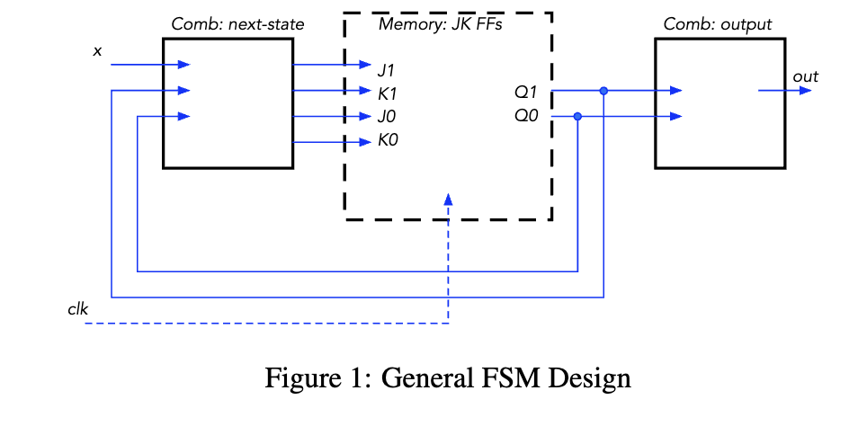
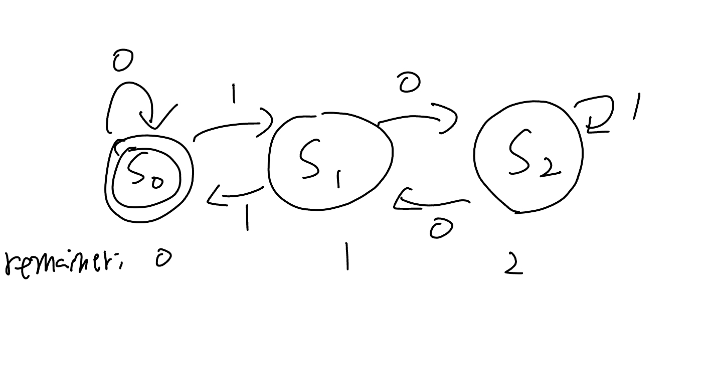
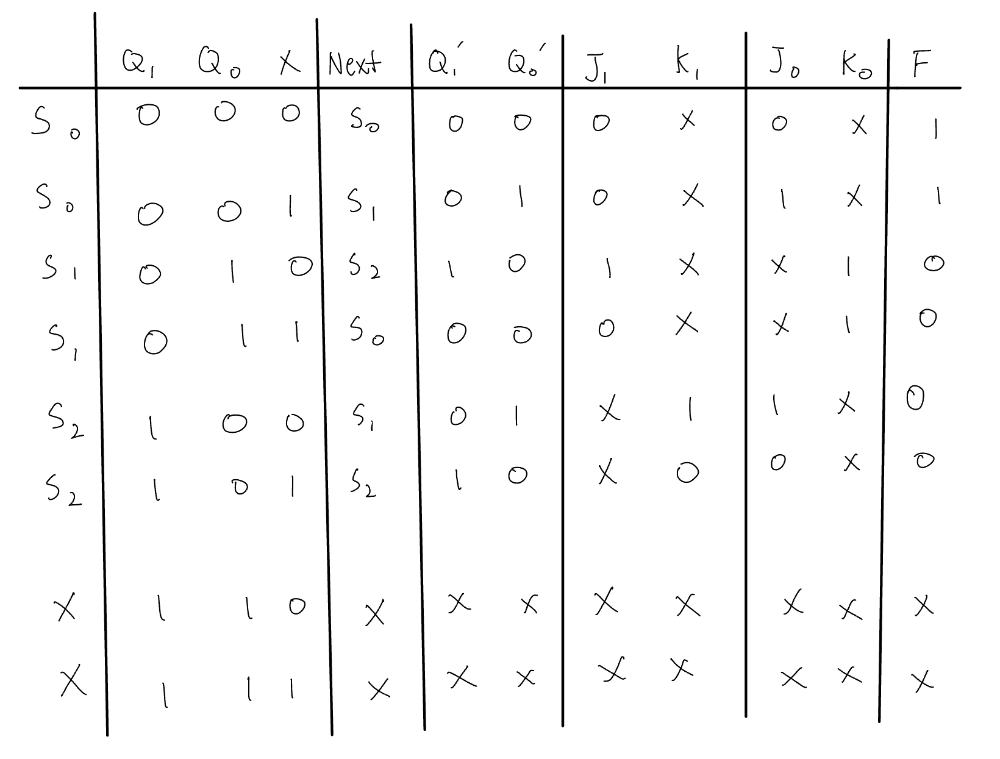
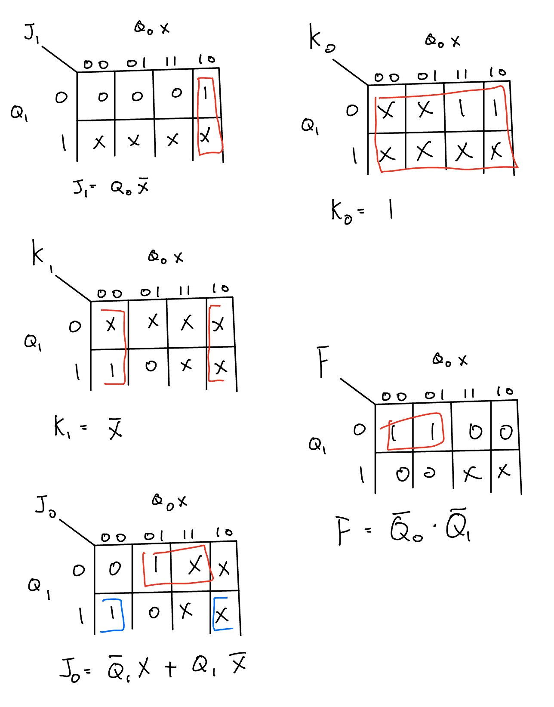

# Lab 5: Finite State Machine Design

# Overview and Motivation
Welcome to Lab 5 of CS281: Introduction to Computer Systems!  
In this lab we will build a circuit that reads a binary number and determines if that input is divisible by 3. 
We'll explore how to connect these components with an idea of DFA and JK flip flop.

# Objectives of the Lab
1.  This lab is to design a circuit that reads a binary number input one bit at a time and determines whether the binary number represented by the input is divisible by 3. In this lab we are introduced to the finite state machine/deterministic finite automata (FSA/DFA). This are an essecial component in all of computer science. We will be constructing a sequential circuit that will read in binary digits and determine if the binary number is divisible by 3. We will store these binary digits into something called a JK Flip-flop. A digram for one can be seen below.
    
# Materials
- PB-503 Breadboard prototyping station (an integrated device with a number of electrical components like switches)
- Wires
- Multimeter 
- Resistors
- JK Flip-Flops
- Logic Gates (AND, OR, NOT)
- Computer with Arduino IDE installed

# Overview: 
1. Circuit Design: The binary number will be fed to the circuit, one bit at a time, starting with the highest order bit and ending with
the lowest order bit. Each bit will be clocked into the circuit using a separate clock input.
 

# Circuit Design: 

## 1. Build a Finite State Machine (DFA)

We began by constructing a Finite State Machine (FSM) using a state transition diagram. 
The FSM depicts the various states the circuit can be in and the transitions between them based on the input bits. The machine starts in the S0 state. It is then fed either a 1 or a 0. If it recieves a 1, it moves onto the next state, if its a zero, then it stays in the initial state. The goal of the machine is to create a binary number divisible by 3.  

 

## 2. Build Boolean Truth Table

Build truth table for the J and K inputs of each flip-flop and the output of the circuit.
The outputs of your truth table are the J and K values for each flip flop in your memory portion of the
circuit. You will also have an output for out, the overall circuit output.

 

#### Note: Remember to include don’t cares whenever possible because they greatly ease the circuit design in the next

## 3. Build K-Maps

Using the Boolean Truth Table, create K-Maps and minimized the logical expressions to simplified equations. We will use these simplified circuits to handle input into the Jk flop-flop. It is important to make sure that your simplifications are correct before starting to construct the circuit, as it can lead to mistakes and frustration if they are not.
 

## 4. Build the circuit in logisim
### Testing:
Before constructing the circuit, it is crucial to build it in Logisim to test that the circuit actualy works. We have provided a video demonstrating the correct circuit, but you should build it yourself first and then check with ours if you find yours is not working. You should only need two JK flip-flops for the circuit.

https://github.com/mlcourses/lab-5-blog-post-group2_cs281-1/assets/108073642/11f32647-5268-4655-bce8-5e6d22fedcdf

## 5. Build the circuit on the breadboard
### Building:
1. Wire the clock to one push button. Wire it so that button in the unpressed state is low and the button
pressed is high.
2. Wire the input bit (x) to the other push button. Wire it so that button in the unpressed state is low and the
button pressed is high.
3. Wire values Q1 and Q0 to logic probes 1 and 0 (or 2 and 1). That way we can always see the current
state.

    

 

5. Wire output to the last logic probe.
6. Make use of the CLEAR feature for the FFs so that you can reset the circuit back to the start state
asynchronously.

 
 
#### NOTE: Be sure to read the spec sheet for the JK flip flop very carefully. You will find some additional inputs on the real JK IC that do not appear on the simplified logisim model
 

### Testing:

https://github.com/mlcourses/lab-5-blog-post-group2_cs281-1/assets/108073642/204d8f5e-cbd5-46f5-a917-4371fc74e9cf

 
 

# Conclusion

