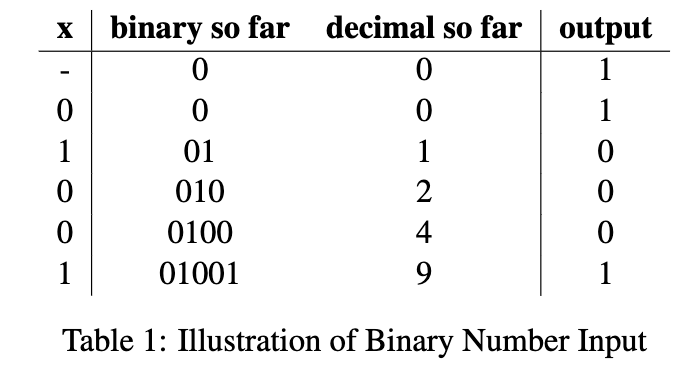

# Lab 5: Finite State Machine Design

# Overview and Motivation
Welcome to Lab 5 of CS281: Introduction to Computer Systems!  
In this lab we will build a circuit that reads a binary number and determines if that input is divisible by 3. 
We'll explore how to connect these components with an idea of DFA and JK flip flop.

# Objectives of the Lab
1. Understand the basic operation of various sensors and actuators.
2. Learn how to connect sensors and actuators to an Arduino.
3. Design and build a project using sensors and actuators, document your process, and showcase it through a video.
   
# Materials
- PB-503 Breadboard prototyping station (an integrated device with a number of electrical components like switches)
- Arduino Uno
- Wires
- Sensors (buzzer, ultrasonic sensor, photoresistor)
- Actuators (buzzer, servo motor)
- Multimeter 
- Resistors
- LED 
- Computer with Arduino IDE installed

# Overview: 

1. Buzzer: Learn how to control a buzzer using the Arduino to produce different tones.

 
 
 
 
 
 
 

https://github.com/AdvancedUno/lab-5-blog-post-group2_cs281-1/assets/108073642/25083ae7-0a83-4122-8dc2-e3a05703fd09

https://github.com/AdvancedUno/lab-5-blog-post-group2_cs281-1/assets/108073642/590413de-dfee-4612-b595-be562c99fcab

# Circuit Design: 
## 1. Build a Finite State Machine (DFA)

### 0 About

In this section, we will build a buzzer that generates sound.  
We will control the buzzer with a wave of pulses that we will generate.  

#### What we need
- Arduino Uno or compatible board
- Breadboard
- Wires
- buzzer
- Computer with Arduino IDE installed

 
### 1. Project Step

#### Note: When a 5 voltage is applied to the input pins, the metallic membrane enters an excited state and without the voltage applied, it is contracted. This rotation creates audible click

### 2. Testing
#### Test 1
1. Plug the buzzer onto the breadboard so that the two pins span two distinct rows. Make sure the + pin is in
the higher row (up) and the - pin is in the lower row (down).
2. Use a wire to connect the - pin to the ground. Plug a longer test wire in the + pin.
3. Now take the other end of the + wire alternately touch it and release it to any +5V connection. You
should hear an audible “click” each time you touch or release the +5V.

 
 

# Conclusion

This lab allowed us to get a deeper understanding of sensors and actuators such as buzzers and ultrasonic sensors.
By using an Arduino device and circuit, we created tools that may have practical use in our daily lives instead of just wiring circuits and testing. For the last component of the lab, we practiced how to combine two or more devices and tools to create more complex and useful devices that can be good practice for future labs and even for future careers. 

